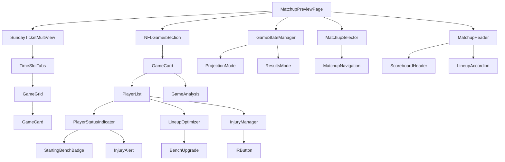
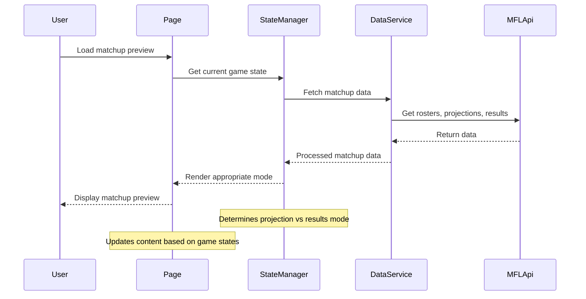

# Design Document

## Overview

The Dynamic Matchup Previews feature transforms the existing single-matchup preview page into a comprehensive weekly matchup system that handles all league matchups (8 regular, up to 16 for doubleheader weeks). The system provides dynamic content that evolves from pre-game projections to post-game analysis, with personalized player analysis, time-zone aware scheduling, and reusable Sunday Ticket multi-view components.

The design builds upon the existing `matchup-preview-example.astro` implementation, extending it to support multiple matchups, dynamic game states, and enhanced user navigation while maintaining the current visual design and functionality.

## Architecture

### Component Architecture



### Data Flow Architecture



## Components and Interfaces

### Core Components

#### 1. MatchupPreviewPage
- **Purpose**: Main page component orchestrating all matchup preview functionality
- **Props**: `weekNumber: number`, `matchupId?: string`, `teamId?: string`
- **State**: Current matchup, game states, user preferences
- **Responsibilities**: Route handling, state management, component coordination

#### 2. MatchupSelector
- **Purpose**: Navigation component for switching between different matchups
- **Props**: `currentMatchup: string`, `availableMatchups: Matchup[]`, `onMatchupChange: (id: string) => void`
- **Features**: Dropdown/modal interface, team name display, URL updating

#### 3. SundayTicketMultiView (Reusable Component)
- **Purpose**: Displays top 4 games for optimal viewing experience
- **Props**: `games: NFLGame[]`, `timeSlot: 'early' | 'late'`, `maxGames: number`
- **Features**: Tab interface for time slots, RedZone fallback, responsive grid
- **Reusability**: Exportable for use on other pages

#### 4. GameStateManager
- **Purpose**: Manages dynamic content based on game completion status
- **Interface**: 
  ```typescript
  interface GameState {
    isPreGame: boolean;
    isInProgress: boolean;
    isCompleted: boolean;
    lastUpdated: Date;
  }
  ```

#### 5. LineupAccordion
- **Purpose**: Collapsible interface showing full starting lineups for both teams
- **Props**: `homeLineup: StartingLineup`, `awayLineup: StartingLineup`, `isExpanded: boolean`
- **Features**: Minimal space usage when collapsed, complete roster view when expanded

#### 6. PlayerStatusIndicator
- **Purpose**: Visual indicators for player lineup status and injury concerns
- **Props**: `player: FantasyPlayer`, `isStarting: boolean`, `injuryStatus: PlayerStatus`
- **Features**: Starting/bench badges, pulsating injury alerts, optimization suggestions

#### 7. LineupOptimizer
- **Purpose**: Analyzes and suggests lineup improvements
- **Props**: `roster: FantasyPlayer[]`, `startingLineup: StartingLineup`
- **Features**: Bench upgrade detection, projected point comparisons, analysis integration

#### 10. AnalysisGenerator
- **Purpose**: Creates intelligent matchup analysis with lineup optimization focus
- **Props**: `matchup: Matchup`, `lineupIssues: LineupOptimization[]`
- **Features**: Prioritizes critical lineup decisions, highlights injury concerns, calls out significant bench upgrades

#### 8. InjuryManager
- **Purpose**: Handles injury-related actions and IR management
- **Props**: `player: FantasyPlayer`, `onIRMove: (playerId: string) => void`
- **Features**: IR eligibility detection, one-click IR moves, lineup page links

#### 9. ScoreUpdater
- **Purpose**: Real-time score updates throughout game days
- **Features**: Sunday live updates, daily refresh cycles, analysis stability

### Data Models

#### Matchup Interface
```typescript
interface Matchup {
  id: string;
  week: number;
  homeTeam: FantasyTeam;
  awayTeam: FantasyTeam;
  nflGames: NFLGame[];
  gameState: 'pre-game' | 'in-progress' | 'completed';
  projectedTotal?: number;
  actualTotal?: number;
  analysis: string;
  lastUpdated: Date;
}
```

#### NFLGame Interface
```typescript
interface NFLGame {
  id: string;
  team1: string;
  team2: string;
  players: FantasyPlayer[];
  playerCount: number;
  gameTime: Date;
  timeSlot: 'early' | 'late';
  isCompleted: boolean;
  projectedPoints?: number;
  actualPoints?: number;
  isGameOfWeek?: boolean;
  analysis?: string;
  weather?: WeatherInfo;
  broadcast?: BroadcastInfo;
}
```

#### FantasyPlayer Interface
```typescript
interface FantasyPlayer {
  id: string;
  name: string;
  position: string;
  nflTeam: string;
  fantasyTeamId: string;
  projectedPoints?: number;
  actualPoints?: number;
  matchupData?: PlayerMatchupData;
  newsUpdates?: PlayerNews[];
  isStarting: boolean;
  injuryStatus: 'Healthy' | 'Questionable' | 'Doubtful' | 'Out' | 'IR';
  isIReligible?: boolean;
  benchUpgrade?: {
    hasUpgrade: boolean;
    upgradePlayer?: FantasyPlayer;
    pointsDifference?: number;
  };
}
```

#### StartingLineup Interface
```typescript
interface StartingLineup {
  teamId: string;
  week: number;
  positions: {
    QB: FantasyPlayer[];
    RB: FantasyPlayer[];
    WR: FantasyPlayer[];
    TE: FantasyPlayer[];
    FLEX: FantasyPlayer[];
    K: FantasyPlayer[];
    DEF: FantasyPlayer[];
  };
  bench: FantasyPlayer[];
  totalProjected: number;
  totalActual?: number;
  optimizationOpportunities: LineupOptimization[];
}
```

#### LineupOptimization Interface
```typescript
interface LineupOptimization {
  type: 'bench_upgrade' | 'injury_warning' | 'ir_eligible';
  severity: 'low' | 'medium' | 'high';
  startingPlayer: FantasyPlayer;
  suggestedPlayer?: FantasyPlayer;
  pointsDifference?: number;
  message: string;
  actionUrl?: string;
  includeInAnalysis: boolean; // Whether this issue should be mentioned in matchup analysis
  analysisText?: string; // Pre-generated text for analysis inclusion
}
```

#### AnalysisPrompt Interface
```typescript
interface AnalysisPrompt {
  matchupContext: {
    homeTeam: string;
    awayTeam: string;
    week: number;
    gameState: GameState;
  };
  criticalIssues: {
    injuredStarters: LineupOptimization[];
    significantUpgrades: LineupOptimization[];
  };
  focusAreas: string[];
  maxSentences: number; // Always 2-3
  tone: 'predictive' | 'analytical'; // Based on game state
}
```

#### ScoreUpdate Interface
```typescript
interface ScoreUpdate {
  matchupId: string;
  homeScore: number;
  awayScore: number;
  lastUpdated: Date;
  gameStates: Record<string, GameState>;
  analysisGenerated: {
    preGame: boolean;
    postGame: boolean;
  };
}
```

## Correctness Properties

*A property is a characteristic or behavior that should hold true across all valid executions of a system-essentially, a formal statement about what the system should do. Properties serve as the bridge between human-readable specifications and machine-verifiable correctness guarantees.*
Property 1: Matchup display completeness
*For any* week with N matchups (where N ≤ 16), the system should display exactly N matchup previews
**Validates: Requirements 1.2, 1.3**

Property 2: Chronological matchup ordering
*For any* set of matchups in a week, they should be displayed in chronological order based on their earliest game times
**Validates: Requirements 1.1**

Property 3: Matchup layout consistency
*For any* set of displayed matchups, each matchup should contain the same structural elements (header, games section, analysis)
**Validates: Requirements 1.4**

Property 4: Matchup navigation completeness
*For any* league week, the navigation mechanism should provide access to all available matchups in that week
**Validates: Requirements 1.5, 7.2**

Property 5: Time zone display accuracy
*For any* game time and user timezone, the displayed time should correctly reflect the user's local timezone
**Validates: Requirements 2.1, 2.2, 2.4**

Property 6: Calendar icon usage
*For any* time display element, it should use a calendar icon rather than a clock icon
**Validates: Requirements 2.3**

Property 7: Sunday Ticket game count handling
*For any* number of relevant NFL games N, the Sunday Ticket component should display exactly min(N, 4) games plus RedZone if N < 4
**Validates: Requirements 3.1, 3.2, 3.3, 3.4**

Property 8: Time slot tab separation
*For any* set of games spanning multiple time slots, separate tabs should be created for early (10 AM PT) and late (1 PM PT) games
**Validates: Requirements 3.5**

Property 9: Analysis uniqueness per matchup
*For any* two different matchups, their generated analysis content should be distinct and specific to the teams involved
**Validates: Requirements 4.1**

Property 10: Analysis length constraint
*For any* generated game analysis, it should contain between 2-3 sentences
**Validates: Requirements 4.2**

Property 32: Critical lineup issue prioritization
*For any* matchup analysis, players with Doubtful/Out status in starting lineups should be the primary focus of the analysis
**Validates: Requirements 4.6**

Property 33: Bench upgrade analysis inclusion
*For any* matchup with significant bench-to-starter projection discrepancies, these should be highlighted in the analysis
**Validates: Requirements 4.7**

Property 34: Analysis focus hierarchy
*For any* matchup with multiple lineup issues, critical decisions should take priority in the analysis content
**Validates: Requirements 4.8**

Property 11: Player mention contextual relevance
*For any* player appearing in multiple matchups, they should only be mentioned in analysis for matchups where their fantasy team is actually competing
**Validates: Requirements 4.3**

Property 12: Game of the Week designation
*For any* set of NFL games in a matchup, the game with the highest projected points should be designated as "Game of the Week"
**Validates: Requirements 4.4**

Property 13: Player count display accuracy
*For any* NFL game, the displayed player count should equal the actual number of fantasy players involved, accompanied by a roster icon
**Validates: Requirements 4.5**

Property 14: Game state content switching
*For any* game transitioning from pre-game to completed state, projected points should be replaced with actual points and predictive analysis should become results commentary
**Validates: Requirements 5.1, 5.2, 5.3**

Property 15: Completed game reordering
*For any* set of games where some are completed, completed games should appear at the bottom while maintaining chronological order within each group
**Validates: Requirements 5.4, 5.5**

Property 16: News update propagation
*For any* player news update, it should appear in all matchups where that player's fantasy team is competing
**Validates: Requirements 6.1, 6.5**

Property 17: News chronological ordering
*For any* set of player news items, they should be ordered with the most recent updates first
**Validates: Requirements 6.3**

Property 18: Analysis injury status reflection
*For any* player whose injury status changes, the analysis should update to reflect their new availability status
**Validates: Requirements 6.4**

Property 19: Default matchup routing
*For any* user accessing via email link, their default team's matchup should be displayed
**Validates: Requirements 7.1**

Property 20: Matchup selection consistency
*For any* matchup switch, the page structure and functionality should remain consistent
**Validates: Requirements 7.3**

Property 21: Team identification clarity
*For any* matchup in the selection interface, both team names should be clearly displayed
**Validates: Requirements 7.4**

Property 22: URL shareability
*For any* selected matchup, the URL should update to reflect the selection for sharing purposes
**Validates: Requirements 7.5**

Property 23: Starting lineup indication
*For any* player in a matchup, their starting/bench status should be accurately displayed based on MFL API data
**Validates: Requirements 8.1**

Property 24: Lineup optimization detection
*For any* starting lineup, players with higher-projected bench alternatives should be identified and highlighted
**Validates: Requirements 8.2, 8.3**

Property 25: Lineup accordion functionality
*For any* matchup, the lineup accordion should provide access to complete starting lineups while maintaining minimal space when collapsed
**Validates: Requirements 8.4, 8.5**

Property 26: Real-time score updates
*For any* active game day, scores should update throughout the day while maintaining analysis stability
**Validates: Requirements 9.1, 9.2**

Property 27: Analysis generation stability
*For any* game state transition, analysis should be generated exactly once per state and never regenerated
**Validates: Requirements 9.3, 9.4, 9.5**

Property 28: Injury status visual alerts
*For any* starting player with Out/Doubtful/IR status, a pulsating animation should be displayed
**Validates: Requirements 10.1**

Property 29: Lineup correction accessibility
*For any* problematic lineup decision, a direct link to the submit lineup page should be provided
**Validates: Requirements 10.2**

Property 30: IR eligibility detection
*For any* injured player not on IR, the system should determine IR eligibility based on league rules
**Validates: Requirements 10.3**

Property 31: One-click IR management
*For any* IR-eligible player, a functional button should be provided to move them to IR status immediately
**Validates: Requirements 10.4, 10.5**

## Error Handling

### Data Availability Errors
- **Missing Matchup Data**: Display fallback message with retry mechanism
- **Incomplete NFL Schedule**: Show available games with notification of missing data
- **Player Data Unavailable**: Display player names without projections/stats
- **News Service Outage**: Continue displaying cached news with timestamp indication

### Time Zone Handling Errors
- **Invalid Timezone Detection**: Default to Pacific Time with user override option
- **Time Conversion Failures**: Display original time with timezone indicator
- **Daylight Saving Transitions**: Handle edge cases with explicit timezone labels

### Component Rendering Errors
- **Sunday Ticket Component Failures**: Gracefully degrade to simple game list
- **Analysis Generation Errors**: Display generic matchup information
- **Icon Loading Failures**: Use text fallbacks for missing icons
- **Lineup Accordion Failures**: Show basic roster information without accordion functionality
- **Animation Rendering Issues**: Fall back to static visual indicators for injury warnings

### Navigation Errors
- **Invalid Matchup IDs**: Redirect to first available matchup with notification
- **URL Parameter Corruption**: Reset to default state with error logging
- **Deep Link Failures**: Provide navigation breadcrumbs for recovery

### MFL API Integration Errors
- **Starting Lineup API Failures**: Display cached lineup data with staleness indicator
- **Score Update API Timeouts**: Continue with last known scores and retry mechanism
- **IR Move API Failures**: Show error message and provide manual IR page link
- **Player Status API Unavailable**: Use cached injury data with warning about freshness

## Testing Strategy

### Unit Testing Approach
The system will use comprehensive unit tests to verify specific functionality:

- **Component Rendering**: Test each component renders correctly with various prop combinations
- **Data Transformation**: Verify data processing functions handle edge cases properly
- **Time Zone Logic**: Test timezone conversion with various inputs and edge cases
- **Game State Transitions**: Verify correct behavior when games change states
- **URL Routing**: Test navigation and deep linking functionality
- **Lineup Optimization Logic**: Test bench upgrade detection and IR eligibility calculations
- **Analysis Generation Logic**: Test intelligent analysis prioritization and lineup issue integration
- **Score Update Mechanisms**: Verify real-time updates and analysis stability
- **MFL API Integration**: Test all API calls with various response scenarios

### Property-Based Testing Approach
The system will implement property-based testing using **fast-check** for JavaScript/TypeScript to verify universal properties across all valid inputs:

- **Minimum 100 iterations** per property test to ensure thorough coverage
- **Smart generators** that create realistic test data within valid input spaces
- **Comprehensive property coverage** for all 34 identified correctness properties
- **Integration with existing test framework** for seamless CI/CD execution

Each property-based test will be tagged with comments explicitly referencing the design document property using the format: `**Feature: dynamic-matchup-previews, Property N: [property description]**`

### Testing Framework Configuration
- **Unit Tests**: Jest with React Testing Library for component testing
- **Property Tests**: fast-check library with custom generators for fantasy football data
- **Integration Tests**: Playwright for end-to-end user workflow testing
- **Performance Tests**: Lighthouse CI for page load and rendering performance

### Test Data Generation Strategy
- **Realistic Fantasy Data**: Generate valid team rosters, player stats, and matchup scenarios
- **Time Zone Variations**: Test across multiple timezone configurations
- **Game State Combinations**: Generate various combinations of completed/upcoming games
- **Edge Case Coverage**: Include boundary conditions like 0 games, 16 matchups, etc.
- **Lineup Scenarios**: Generate starting lineups with various optimization opportunities
- **Injury Status Combinations**: Test all injury designations and IR eligibility scenarios
- **Score Update Patterns**: Simulate real-time score changes throughout game days