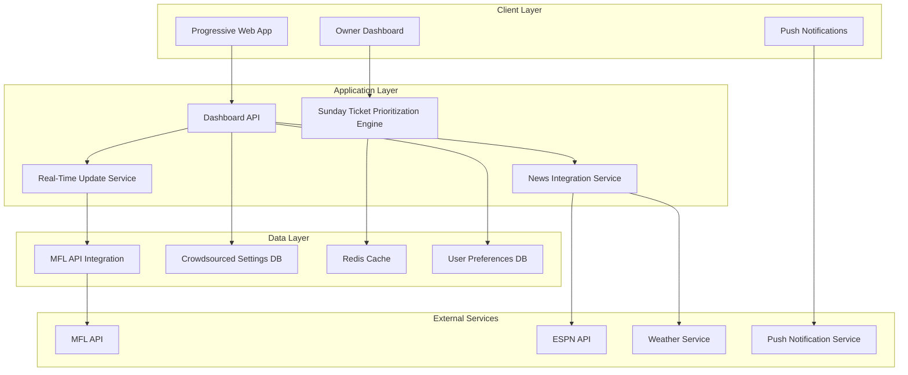

# Design Document

## Overview

The Owner Multi-League Dashboard transforms the fantasy football experience from a single-league tool into a comprehensive multi-league owner dashboard. This system enables fantasy owners to manage multiple leagues simultaneously, with intelligent prioritization based on league importance, playoff status, and personal preferences. The dashboard provides real-time updates, push notifications, and a unified Sunday viewing experience optimized for the modern multi-league fantasy owner.

## Architecture

### High-Level Architecture



### Component Architecture

The system follows a modular architecture with clear separation of concerns:

1. **Presentation Layer**: Progressive Web App with responsive design
2. **Business Logic Layer**: Prioritization algorithms and real-time processing
3. **Data Access Layer**: MFL API integration and caching
4. **External Integration Layer**: News sources and notification services

## Components and Interfaces

### Core Components

#### 1. Owner Dashboard Component
- **Purpose**: Main interface for multi-league matchup management
- **Responsibilities**: 
  - Display all league matchups with visual grouping
  - Provide league weighting configuration
  - Handle player focus mode switching
  - Show playoff/regular season indicators
  - Link to external multi-league live scoring app

#### 2. Sunday Ticket Prioritization Engine
- **Purpose**: Intelligent game ranking across all leagues
- **Responsibilities**:
  - Calculate composite importance scores
  - Apply league weighting multipliers
  - Handle playoff/bracket importance
  - Manage tiebreaking logic

#### 3. Real-Time Update Service
- **Purpose**: Maintain current player and game status
- **Responsibilities**:
  - Poll MFL API every 5 minutes on Sundays
  - Process injury status changes
  - Update projected points
  - Trigger UI refreshes

#### 4. Push Notification System
- **Purpose**: Deliver critical updates to mobile devices
- **Responsibilities**:
  - Register PWA for push notifications
  - Filter notifications by league importance
  - Batch rapid updates to prevent spam
  - Provide email backup notifications

#### 5. News Integration Service
- **Purpose**: Aggregate injury and weather information
- **Responsibilities**:
  - Fetch from multiple news sources
  - Prioritize news by player importance
  - Handle conflicting reports
  - Display weather alerts for outdoor games

#### 6. Crowdsourced Settings Manager
- **Purpose**: Manage shared league configuration data
- **Responsibilities**:
  - Aggregate bracket importance from multiple owners
  - Provide defaults for new league members
  - Handle user preference overrides
  - Maintain league-specific settings

### Interface Definitions

#### League Configuration Interface
```typescript
interface LeagueConfig {
  leagueId: string;
  name: string;
  importance: number; // 1-10 scale
  regularSeasonLength: number;
  bracketImportance: {
    championship: number; // 0-10 scale
    consolation: number;
    toiletBowl: number;
  };
  playoffWeeks: number[];
}
```

#### Owner Preferences Interface
```typescript
interface OwnerPreferences {
  ownerId: string;
  playerFocusMode: 'my-players-only' | 'my-players-and-opponents';
  notificationSettings: {
    injuryAlerts: boolean;
    lineupChanges: boolean;
    weatherAlerts: boolean;
    leagueImportanceFilter: number; // minimum league importance for notifications
  };
  leagues: LeagueConfig[];
}
```

#### Game Importance Score Interface
```typescript
interface GameImportanceScore {
  gameId: string;
  baseScore: number;
  leagueWeight: number;
  bracketMultiplier: number;
  playoffMultiplier: number;
  finalScore: number;
  players: PlayerImpact[];
}
```

## Data Models

### Owner Data Model
```typescript
class Owner {
  id: string;
  name: string;
  email: string;
  preferences: OwnerPreferences;
  leagues: League[];
  
  calculateSundayTicketGames(): GameImportanceScore[];
  updateLeagueImportance(leagueId: string, importance: number): void;
  togglePlayerFocusMode(): void;
}
```

### League Data Model
```typescript
class League {
  id: string;
  name: string;
  platform: 'MFL' | 'ESPN' | 'Yahoo';
  currentWeek: number;
  regularSeasonLength: number;
  playoffStructure: PlayoffBracket[];
  owners: Owner[];
  
  isPlayoffWeek(week: number): boolean;
  getBracketType(week: number): 'championship' | 'consolation' | 'toiletBowl';
  getMatchupsForWeek(week: number): Matchup[];
}
```

### Matchup Data Model
```typescript
class Matchup {
  id: string;
  leagueId: string;
  week: number;
  homeTeam: Team;
  awayTeam: Team;
  bracketType: 'championship' | 'consolation' | 'toiletBowl' | 'regular';
  gameState: 'pre-game' | 'in-progress' | 'completed';
  
  calculateImportanceScore(ownerPrefs: OwnerPreferences): number;
  getRelevantPlayers(ownerId: string, focusMode: string): Player[];
}

// Note: Starting lineup functionality removed - replaced with external link to existing multi-league live scoring app
```
```

### Real-Time Update Data Model
```typescript
class PlayerUpdate {
  playerId: string;
  timestamp: Date;
  updateType: 'injury' | 'lineup' | 'projection' | 'weather';
  oldValue: any;
  newValue: any;
  affectedLeagues: string[];
  urgency: 'low' | 'medium' | 'high' | 'critical';
  
  shouldNotifyOwner(ownerId: string, preferences: OwnerPreferences): boolean;
  getNotificationMessage(): string;
}
```

## Correctness Properties

*A property is a characteristic or behavior that should hold true across all valid executions of a system-essentially, a formal statement about what the system should do. Properties serve as the bridge between human-readable specifications and machine-verifiable correctness guarantees.*

### Property Reflection

Before defining the correctness properties, I've analyzed the requirements to eliminate redundancy and ensure each property provides unique validation value:

- **League Display Properties (1-3)**: Combined into comprehensive multi-league display validation
- **Prioritization Properties (4-8)**: Consolidated mathematical calculation properties while maintaining distinct algorithm components
- **Configuration Properties (9-12)**: Merged related input validation and default value properties
- **Real-time Properties (13-16)**: Combined update timing and notification properties for efficiency
- **Integration Properties (17-19)**: Consolidated external service integration validation

### Core System Properties

**Property 1: Multi-league display completeness**
*For any* owner with connected leagues, the dashboard should display all active matchups grouped by league with appropriate visual separation and error handling for unavailable data
**Validates: Requirements 1.1, 1.2, 1.4**

**Property 2: League weighting calculation accuracy**
*For any* set of games across multiple leagues, the Sunday Ticket prioritization should correctly multiply player projections by league weighting values and use projected points for tiebreaking
**Validates: Requirements 2.2, 2.3**

**Property 3: Player focus mode filtering consistency**
*For any* player focus mode selection, the system should consistently include only the specified players (owner-only vs owner-and-opponents) in game ranking calculations and immediately recalculate when mode changes
**Validates: Requirements 3.2, 3.3, 3.5**

**Property 4: Playoff detection and multiplier application**
*For any* game classification, the system should correctly identify playoff/consolation status and apply the appropriate multipliers (2x for playoffs, 0.5x for consolation)
**Validates: Requirements 4.2, 4.3**

**Property 5: Bracket importance calculation integration**
*For any* bracket configuration, the system should correctly multiply base game scores by bracket importance values and apply default values when not configured
**Validates: Requirements 5.3**

**Property 6: Crowdsourced settings aggregation and precedence**
*For any* league with multiple owners, the system should properly aggregate bracket importance values and prioritize user-specific overrides over crowdsourced defaults
**Validates: Requirements 6.1, 6.3**

**Property 7: Game type visual indicator consistency**
*For any* game classification, the system should display appropriate visual indicators for championship, consolation, and toilet bowl games
**Validates: Requirements 7.2, 7.3, 7.4**

**Property 8: Admin feature toggle functionality**
*For any* league configuration, the match analysis feature should activate/deactivate correctly based on admin settings while maintaining normal dashboard functionality when disabled
**Validates: Requirements 8.2, 8.3, 8.5**

**Property 9: Sunday Ticket game ranking algorithm**
*For any* combination of player projections, league weighting, and bracket importance, the system should correctly calculate composite scores, display exactly 4 top games, and recalculate when inputs change
**Validates: Requirements 9.1, 9.2, 9.4**

**Property 10: Real-time update timing and notification**
*For any* player status change during Sunday game days, the system should refresh data within 5 minutes, highlight affected games, and update projections immediately
**Validates: Requirements 10.1, 10.2, 10.3**

**Property 11: Push notification delivery and batching**
*For any* critical player update, the system should send appropriate notifications to affected owners while batching rapid updates to prevent spam
**Validates: Requirements 11.1, 11.2, 11.5**

**Property 12: News integration prioritization and conflict handling**
*For any* news update, the system should prioritize information by player importance across leagues and display multiple sources with timestamps when conflicts exist
**Validates: Requirements 12.4, 12.5**

**Property 13: PWA offline functionality and notification registration**
*For any* PWA installation, the system should support offline viewing of cached data and properly register for browser push notifications
**Validates: Requirements 13.2, 13.3**

**Property 14: External link functionality and error handling**
*For any* navigation to external MFL scoring page, the system should open links in new tabs and display appropriate error messages when pages are unavailable
**Validates: Requirements 14.2, 14.4**

**Property 15: Initial configuration and expansion validation**
*For any* dashboard setup, the system should start with exactly two leagues, maintain settings during expansion, and validate complete configuration before activation
**Validates: Requirements 15.1, 15.2, 15.5**

## Error Handling

### Error Categories and Strategies

#### 1. MFL API Failures
- **Strategy**: Graceful degradation with cached data
- **Implementation**: Redis cache with 15-minute TTL for critical data
- **User Experience**: Show last known data with "updating..." indicators

#### 2. Real-Time Update Failures
- **Strategy**: Exponential backoff retry with circuit breaker
- **Implementation**: Retry failed requests with increasing delays (1s, 2s, 4s, 8s)
- **User Experience**: Display connection status and manual refresh option

#### 3. Push Notification Failures
- **Strategy**: Fallback to email notifications
- **Implementation**: Queue failed push notifications for email delivery
- **User Experience**: Notify users of delivery method changes

#### 4. League Configuration Errors
- **Strategy**: Validation with helpful error messages
- **Implementation**: Client-side and server-side validation
- **User Experience**: Inline error messages with correction suggestions

#### 5. Cross-League Data Inconsistencies
- **Strategy**: Per-league isolation with conflict resolution
- **Implementation**: Separate data contexts per league with merge strategies
- **User Experience**: Clear indicators when data sources differ

## Testing Strategy

### Dual Testing Approach

The system requires both unit testing and property-based testing to ensure comprehensive coverage:

**Unit Tests**: Verify specific examples, edge cases, and integration points between components. Unit tests catch concrete bugs in implementation details.

**Property Tests**: Verify universal properties that should hold across all inputs. Property tests verify general correctness of algorithms and business logic.

Together they provide comprehensive coverage where unit tests catch specific bugs and property tests verify general correctness.

### Property-Based Testing Requirements

- **Testing Library**: fast-check for JavaScript/TypeScript property-based testing
- **Test Configuration**: Minimum 100 iterations per property test for thorough coverage
- **Property Test Tagging**: Each property-based test must include a comment with the format: `**Feature: owner-multi-league-dashboard, Property {number}: {property_text}**`

### Unit Testing Focus

Unit tests will cover:
- Component rendering with various league configurations
- API integration error scenarios
- User interaction flows (league weighting, focus mode switching)
- Edge cases (empty leagues, network failures, invalid configurations)

### Integration Testing

- End-to-end user workflows from league setup to Sunday viewing
- Cross-component interactions during real-time updates
- PWA functionality including offline mode and push notifications
- Admin feature toggle effects across multiple user sessions

The testing strategy ensures both the mathematical correctness of prioritization algorithms and the reliability of real-time update systems under various failure conditions.