# Rosters on a phone

Proposal for making both leagues' Rosters pages usable below 768px:
`src/pages/theleague/rosters.astro` (GM + Coach modes, contracts, cap,
simulations) and `src/pages/afl-fantasy/rosters.astro` (one matchup-shaped
view). **Design only. No `src/` file is changed by this document.**

Screenshots and the static mockup live in
[`rosters-mobile-layout/`](rosters-mobile-layout/). The mockup
(`mockup.html`) is not app code; it renders straight from the repo.

## Rules this design keeps

These were decided before the design started. It works inside them rather than
reopening them.

1. **Nothing is removed.** Every column, cell badge, indicator, row action and
   page-level panel has a named home on a phone. The inventory below is the
   contract, and Phase 6 turns it into a guard test.
2. **Desktop does not change.** Every rule lives under
   `@media (max-width: 767px)`, and every sheet addition is opt-in per opener.
   `scripts/roster-parity-check.mjs` at desktop width must report 0 diffs after
   every phase.
3. **Reuse the Free Agents mechanism** (e76462d40a, #1217): a row tap opens the
   shared player sheet, the ⋮ column hides on phones, and what ⋮ did moves into
   the sheet.
4. **GM row:** player (with existing badges), current-year salary, contract
   years. **Coach row:** proposed below.
5. **Cap moves live in the sheet on phones**, and the running cap effect of
   simulated moves stays visible.

Added after the first draft, from the user's Sleeper screenshots (see
[Borrowed from Sleeper](#borrowed-from-sleeper)):

6. Rows are **three-line cards**, not a narrowed table.
7. The sheet gets **tabs**, including a first-class **Salary** tab. It shows
   only when the opener supplies salary data, so the other 17 files that
   import the sheet are unaffected.

---

## 0. Which base to build on

**Start the implementation from `origin/staging`, not from this branch's
`origin/main`.** Do not cherry-pick.

- e76462d40a (the Free Agents phone layout) is on `origin/staging` only.
  `git merge-base --is-ancestor e76462d40a HEAD` fails on this branch.
- `staging` has also moved `rosters.astro` itself: Phase 7 slices 1-3 of
  `rosters-page-split.md` (#1194, #1196) and the unified roster header (#1184).
  A design built on `main` would conflict with all of that.
- `claude/roster-page-mobile-ux-dnjt3f` has no commits of its own; it is just
  `main`'s tip. Re-pointing it at `origin/staging` loses nothing.
  `/live` targets `staging` anyway.
- A cherry-pick would copy a 13-file squash commit (including
  `roster-constants`' bye table, which is unrelated) onto `main`. It would then
  collide with itself at the next promotion.

---

## 1. What a phone gets today (390x844, measured 2026-09-25)

Dev server render, owner cookie for franchise 0001 in both leagues.

| | TheLeague GM | TheLeague Coach | AFL |
|---|---|---|---|
| Table width | 720px (`min-width: 720px` under 900px) | 720px | 740px (`min-width: 740px`) |
| Visible wrapper | 342px | 342px | 326px |
| Columns in the table | Player, ⋮, Yrs, 2026-2030 (+ Rank when a My Rank board exists) | Player, Opp #, Opponent, O/U, Weather, Trend, 2026 Pts, Avg, Opp Avg, Proj (+ W1-Wn when expanded) | Player, ⋮, (Rank), Opp #, Opponent, O/U, Weather, Opp Avg, Total, Avg, Proj |
| Page height | 5,483px | | |

The page itself does not scroll sideways (`scrollWidth == clientWidth`). The
table scrolls sideways inside its card instead. What that costs:

- **Half the first screen shows no data.** The GM table shows Player, ⋮ and
  Yrs, then cuts the 2026 salary mid-number (`$5,000,0`).
  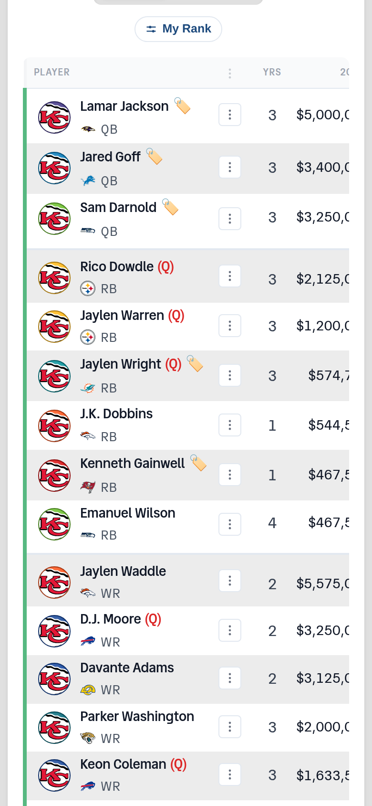
- **Scrolling right loses the player.** There is no sticky first column, so
  the 2027-2030 figures show up with no name next to them.
  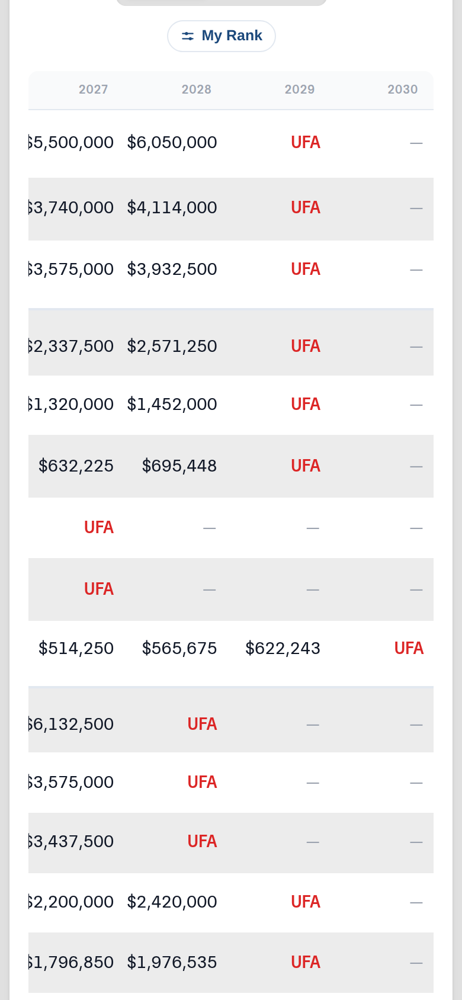
- **Coach mode shows two of ten columns.** Projection, the number a lineup
  decision needs, is the last column and the furthest off-screen.
  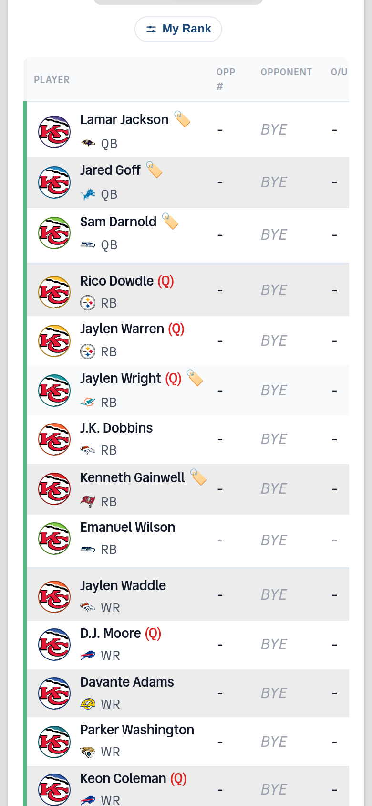
  (Every row reads BYE in this capture. The dev server had no odds feed; that
  is not a layout bug.)
- **The ⋮ column costs about 50px** on every row, to reach an action sheet
  that already works well on a phone.
  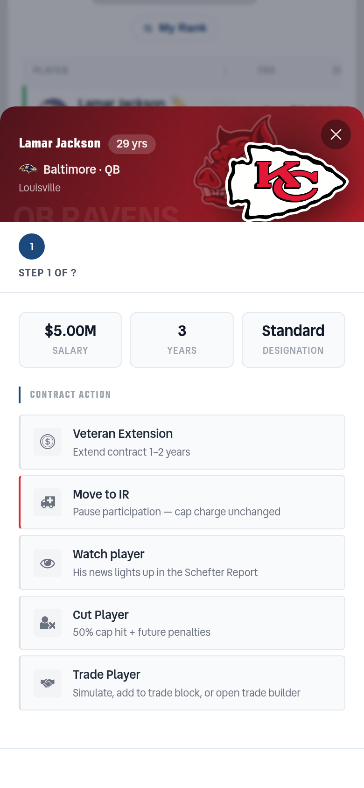
- **Totals are cut off too.** The tfoot's Dead Money / Total / Cap / Space rows
  run off to the right with the year columns.
- **Sorting is off-screen.** Every sort control is a `<th>` in a column the
  viewer cannot see.
- **The dead-money table is also 720px wide**, so its year columns sit
  off-screen as well.
  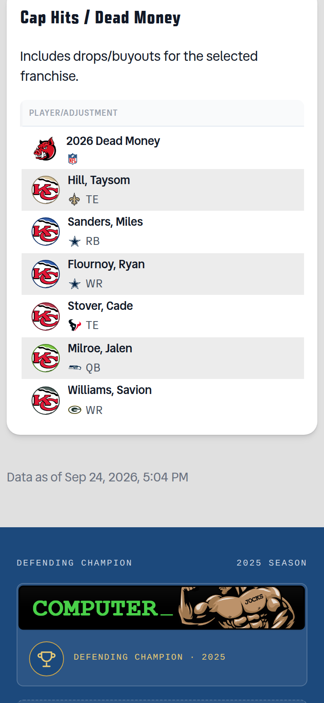
- **The sheet is reachable only from the player's name**, a small target in a
  64px row.
  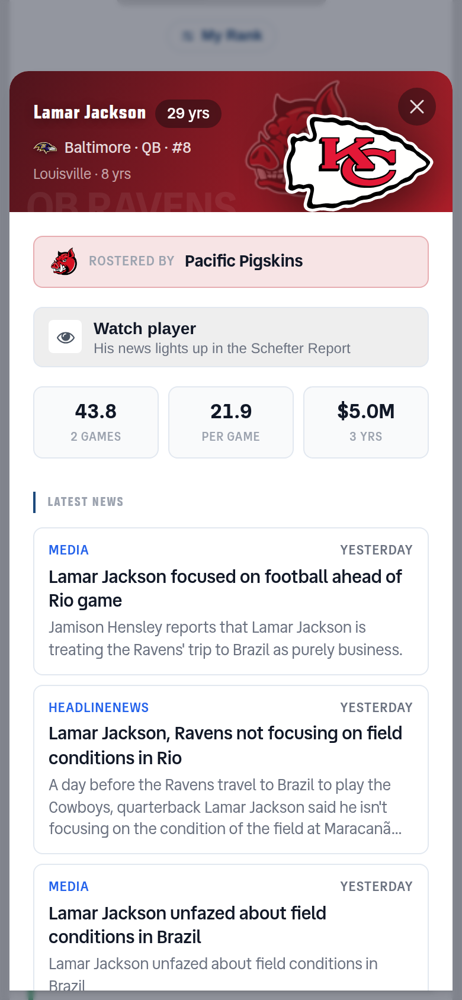
- **Simulated moves have no persistent summary.** The header's cap-space
  figure follows every simulation (`updateView` writes
  `[data-rhdr-stat="cap-space"]`), but the header is ~900px up the page. Clear
  All and Submit sit above the table, a long scroll from the row that was
  changed.
- **AFL has the same problem.** ⋮ plus two columns show; Opponent is cut in
  half. 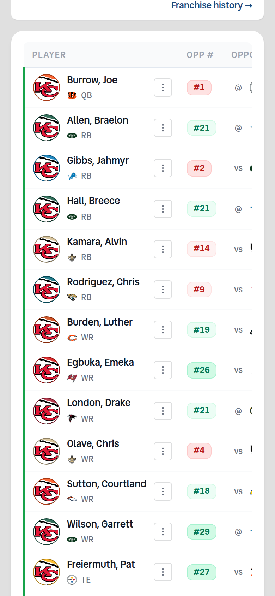

Other captures: `current-theleague-gm-top.png`,
`current-theleague-panels.png`, `current-afl-top.png`,
`current-afl-action-sheet.png`.

---

## Borrowed from Sleeper

The user shared two Sleeper screens: a roster list and a player sheet. Here is
what this design takes from them and what it leaves.

| Sleeper does | We take | Why / how |
|---|---|---|
| No table. Each row is a card: position pill, headshot with the NFL logo on its corner, then three dense lines | **Yes.** Pill, headshot + team badge, three lines, value on the right | It fits a phone far better than any column subset. Built with CSS on the **existing** `<tr>`/`<td>`s (section 3), so neither row builder forks |
| Line 2 = % rostered / % start, line 3 = kickoff, opponent (defense rank coloured by difficulty), weather, injury, news | Line 2 = **contract** in GM (years chip, "thru '28", status). Line 2-3 = **matchup** in Coach | These are our equivalents of "what do I need to know at a glance" |
| Team card: logo, record, win-probability bar, quick-action chips (sched / trade / trans / news) | **Yes, as a cap card**: a cap-room bar split Active / Practice / Dead / sim, and chips for **Sims · Trade · Dead $ · Tags** | TheLeague only. The AFL has no cap |
| Sheet hero: headshot over the team logo, age / height / weight / exp, primary buttons in the hero (DROP, trade block, favourite) | **Yes.** Facts row, and hero quick actions: **Simulate cut · Trade block · Watch · ⋮ more** | Puts the most-used cap move one tap from the row |
| Tabs: Summary / Game Log / Team / History | **Summary · Salary · Game log**, opt-in per opener | Salary is the user's requirement. Game log is the existing Season Results table. Team / History have no content here yet |
| Dark theme | **No** | This site's light and dark tokens apply; the mockups use light |
| Ownership % | **No** | Not data we have. Our slot holds contract (GM) or matchup (Coach) |

---

## 2. The phone row

A three-line card for each roster row, built by CSS from the row's existing
cells.

```
(photo+NFL)  Name (7)  🏷️ (Q) ✂autocut                 $5,000,000   ← GM: 2026 salary
     badge   [QB] [3] yrs | thru '28 | RC/TO/FT           QB 3         ← My Rank, if a board exists
```

**Decided (user, 2026-09-25):** the position pill is NOT its own column. It sits
inline at the start of line 2, directly under the player name, so the avatar is
the card's left edge and the name gets the width a pill column would have taken.

### GM mode

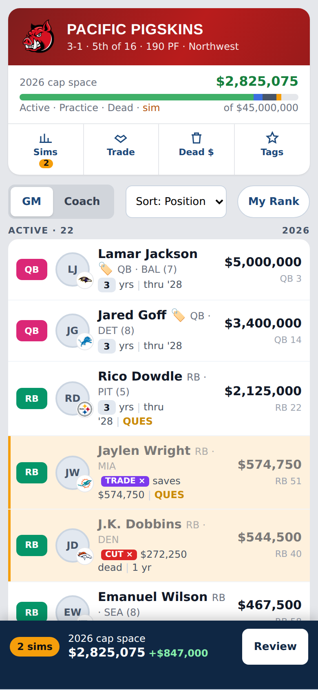

| Part | Content | Source cell |
|---|---|---|
| Left edge | **Roster-status stripe** kept on the card's left edge (active / practice / IR). No pill column | existing row status classes |
| Avatar | Headshot, NFL team logo badged on its corner | `PlayerCell` avatar + `nflTeam` |
| Line 1 | Name + **every existing after-name badge**: trade-block 🏷️ link, injury `(Q)` button, autocut badge, contract-action badge with its × | `[data-column=player]`, unchanged |
| Line 2 | Inline position pill (QB / RB / WR / TE / PK / DEF colours) first, then the years chip (**stays interactive**: eligible / pending declaration, deadline countdown), `thru '28`, contract designation when not Standard, injury word | `[data-column=years]` + a new line-2 span |
| Right, big | Current-year salary, including simulated / declared styling | `[data-column=year1]` |
| Right, small | My Rank (e.g. `QB 3`), only when a board is loaded | `[data-column=rank]` |

**No ellipsis anywhere in a row.** The first mockup pass truncated names and
line 2 with `text-overflow`. That hides data, so lines wrap instead. Line 1
should drop the "QB · BAL" text (the pill and badge already carry it) and keep
only the bye, e.g. `(7)`.

### Coach mode

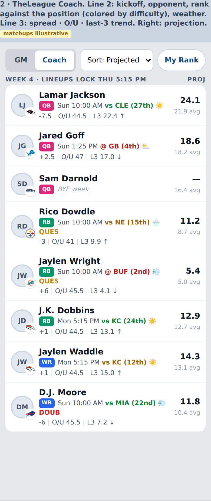

**Proposed minimal set: Player, Opp, Proj.** An owner in Coach mode on a phone
is asking one question: start him or sit him? That needs:

- **Proj.** The column the decision is made on. It leads the right side, with
  season **Avg** underneath as the baseline it is judged against.
- **Opponent + rank against the position.** One glance says whether the
  matchup is soft. The rank is coloured by the existing `rank-tier-*`
  difficulty scale.
- **Injury and weather** as inline marks. They can flip a start.

The rest (spread, O/U, last-3 trend) is useful but secondary, so it goes on a
muted line 3, and everything else moves to the sheet. Line 2 = kickoff,
`vs CLE (27th)`, weather icon, injury word. Line 3 = spread · O/U · L3 trend
arrow.

The **kickoff time is not a column today.** It is the one piece of new data
this design proposes (open question 2). Without it, line 2 starts at the
opponent.

### Controls above the rows (phone)

- The GM / Coach toggle and My Rank stay where they are.
- **New: a Sort `<select>`** carrying every `data-sort-key` in the thead
  (position, oppRank, spreadAmount, overUnder, temperature, avgRecent,
  totalSeason, avgSeason, oppAvg, projectedPoints, topRanking, contractYears,
  salary_0 through salary_4). It calls the same sort the header click does, so
  sorting by a hidden column is not lost.
- Group headers ("Active · 22", "Practice squad · 3", "Injured reserve") take
  the place of the divider rows and the legend's swatch meaning.

### The footer (tfoot)

On a phone the four total rows (Dead Money, Total Salary, Salary Cap, Cap
Space) show the **current year** as label/value lines. Every year's totals move
to the **Cap by year** sheet (section 6), which opens from the cap bar or the
Sims chip.

---

## 3. How the rows are built (mechanism)

- **CSS only, on the existing rows**, in a new global stylesheet
  `src/styles/rosters-mobile.css`. Import it in both pages' **frontmatter**, not
  via `@import` in a scoped `<style>`: that would scope every selector, and the
  rows are `innerHTML` anyway (`docs/claude/insights/domains/frontend.md`).
  - Below 768px: `table`, `tbody` and `td` become `display: block`, each
    `tr` becomes a `display: grid` card with named areas, and the thead is
    `visually-hidden`.
  - Hidden cells get `display: none !important`. **The `!important` is
    load-bearing**, as the Free Agents insight records: `setMode()` writes
    inline `style.display = 'table-cell' | 'none'` on every `.coach-col` and
    `.gm-col` (and `table-row` on `.gm-row`), and the rankings script does the
    same to `.ranking-col`. Mode scoping uses the classes `setMode` already
    puts on `.roster-page`: `.coach-mode` and `.gm-mode`.
  - This is a deliberate exit from table layout under 768px, which is why it
    does not break the "never `display: flex` on a `<td>`" rule. That rule is
    about cells inside a live table grid.
- **Markup additions, in BOTH row builders** (the SSR loop and the client
  `renderTableRows` template, which must stay in step):
  - `data-pos` on the `<tr>`;
  - one `<span class="rr-line2">` (GM contract line) and the Coach line spans.
    They are hidden on desktop by default and shown only under the phone
    query, so desktop parity holds.
- **Rejected: a second, phone-only list rendered from the same data.** That
  would be two sources of truth for 25 rows that change under simulation, and
  the parity harness would not see the second one.
- **Row tap:**
  `initPlayerModalTrigger(rosterTbody, { rowTapMedia: '(max-width: 767px)' })`.
  This is the existing option from #1217. The trigger already leaves
  `a, button, input, select, textarea, label` alone, so the years chip, the
  injury button, the trade-block link and the badge × keep their own clicks.
  The listener is delegated on `tbody`, so it survives the `innerHTML`
  re-render after every simulation. The AFL already binds on `pageRoot`.
- **Hide ⋮:** `.roster-table [data-column="actions"] { display: none !important }`
  under the phone query. The button stays in the DOM, and the sheet's action
  routing uses it (section 5).

---

## 4. The player sheet on the roster page

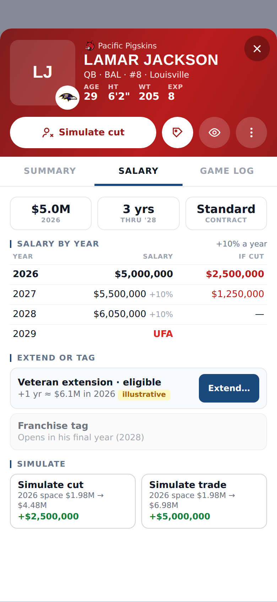
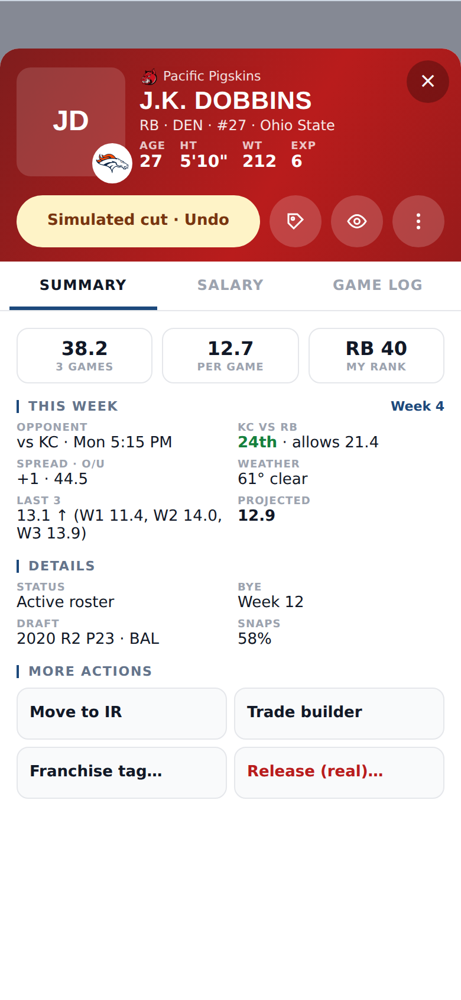

### Structure

```
HERO   photo + NFL logo · owner crest · name · pos/team/#/college
       Age · Ht · Wt · Exp
       [ Simulate cut ] [🏷 trade block] [👁 watch] [⋮ more]   ← quick actions (new, opt-in)
TABS   Summary | Salary | Game log                          ← only when opener sends `salary`
─────────────────────────────────────────────────────────
Summary   metrics tiles · This week (new) · Details · Latest news · More actions (new)
Salary    contract tiles · Salary by year (+ if-cut) · Extend or tag · Simulate
Game log  the existing Season Results table, moved here unchanged
```

### Opt-in: no other page changes

`PlayerDetailsModal` has **no tabs today**, and 18 files import it (on
`staging`: both leagues' players and rosters pages, `projected-free-agents`,
`theleague/index`, `insights`, and components). Tabs and the new sections are
driven by **optional** `PlayerModalData` fields. When a field is absent, the
sheet renders **exactly as it does today**: no tablist, the same stacked
sections in the same order. That is the Free Agents precedent (the Snaps / ADP
rows show only when the opener sends them).

| New field (optional) | Renders | Sent by |
|---|---|---|
| `salary: SalarySheetData` | the tablist + Salary tab; Season Results moves into Game log | TheLeague rosters only |
| `sheetTab: 'summary' \| 'salary'` | which tab opens | TheLeague rosters |
| `thisWeek: ThisWeekData` | Summary › This week | both roster pages |
| `quickActions: SheetAction[]` | the hero's action row | both roster pages |
| `moreActions: SheetAction[]` | Summary › More actions | both roster pages |
| `myRank: string` | a metric tile / Details row | both roster pages |
| `onAction(id)` | the callback the page supplies for all of the above | both roster pages |

`SheetAction` = `{ id, label, desc?, icon, tone?: 'danger', disabled?, state?: 'on' }`.

### Which tab opens by default

| Opened from | Default tab | Why |
|---|---|---|
| TheLeague Rosters, **GM** mode | **Salary** | The owner is in cap mode; the future-year salary columns the row hid live there |
| TheLeague Rosters, **Coach** mode | **Summary** | "This week" (the hidden Coach columns) is in Summary |
| AFL Rosters | no tabs (untabbed sheet) | No salary data; see open question 4 |
| Every other page (Free Agents, Insights, Home, Projected FA, AFL Players…) | no tabs (unchanged) | They do not send `salary` |

The tab resets on every open. It is chosen per open from the mode, not
remembered (open question 3).

### Salary tab: content

It is fed by the opener, so the sheet stays league-agnostic and holds no cap
math.

1. **Contract tiles.** Current salary · years left ("3 yrs thru 2028") ·
   designation (Standard / RC / TO / FT) · total remaining (`totalRemaining`,
   already in the payload).
2. **Salary by year.** One row per `SALARY_YEARS` year, 2026 through 2030:
   - the salary, with `+10%` escalation shown;
   - `UFA`, `—`, an eligible **TO** pill (tappable: it opens the same
     declaration flow the row's `.salary-cell--team-option-eligible` cell
     opens), or an expired TO's greyed forfeited salary;
   - **declared** and **simulated** styling, exactly as the row's cells carry
     it.

   **Source: lifted from the row's own `year1`-`year5` cells** (text plus
   state class), the same way #1217 lifts `acqUrl`. The sheet therefore cannot
   disagree with the desktop row, including under simulation. An **"If cut"**
   column comes from `calculateCutPenalty` (`salary-calculations.ts`): 50% this
   year, then the 15-45% future spread.
3. **Extend or tag.** One option row per action the player is eligible for,
   each with its cost:
   - Veteran Extension (`calculateVeteranExtension`, 1 or 2 years);
   - Rookie Extension;
   - Franchise Tag (`calculateFranchiseTag`, with its basis: 120% or top-3
     average);
   - Team Option (`calculateTeamOption`);
   - Declare Contract (with the deadline countdown the years chip shows).

   Actions he is not eligible for show disabled with the reason ("Opens in his
   final year (2028)"). The button routes into the CDM step for that action
   (section 5), which still owns year choice and submit. Eligibility comes from
   the same `getPlayerEligibility` + contract-years rules
   `populateCdmActionOptions` uses. See section 5 for how that stays one
   implementation.
4. **Simulate.** Two buttons, Simulate Cut and Simulate Trade, each previewing
   its result inline: "2026 space $1.98M → $4.48M · +$2,500,000". Tapping one
   applies it locally (`applyContractAction`, as the CDM's `cut-simulate` /
   `trade-simulate` do today). **The sheet stays open** and re-renders showing
   "Simulated cut · Undo" (Undo = `removeContractAction`), while the sim bar
   (section 6) picks up the change. Today the CDM closes after a simulation;
   open question 5.

### Summary tab additions

- **This week** carries every Coach column the row hides:
  - opponent (vs/@), spread, O/U, weather;
  - opponent rank against the position, opponent avg allowed;
  - last-3 avg with trend arrow and the W-n scores the trend columns show;
  - season points, season avg, projected.

  It is lifted from the row's coach cells (`data-label`s already exist on
  every one). AFL: Opp #, Opponent, O/U, Weather, Opp Avg, Total, Avg, Proj.
- **My Rank** as a metric tile when a board is loaded.
- **More actions.** Every ⋮ action not already in the hero (section 5).
- Existing Details, Latest News: unchanged.

### Hero quick actions

| Viewer | Quick actions |
|---|---|
| Owner, own team (TheLeague) | Simulate cut (becomes "Simulated cut · Undo" when active) · Trade block toggle · Watch · ⋮ more |
| Owner, own team (AFL) | Trade block toggle · Watch · ⋮ more |
| Signed in, another team | the existing **Trade for him** (`#pdm-trade`) · Watch · ⋮ more (Simulate trade lives in the TheLeague Salary tab) |
| Signed out | Watch (hands to sign-in, as it does today) · ⋮ more |

The existing `#pdm-actions` row (Watch / Claim / Trade for him / MFL bid)
**becomes** the hero row when `quickActions` is present. It is not duplicated,
so Watch is never offered twice.

### Tabs: accessibility

- WAI-ARIA tabs: `role=tablist` / `tab` / `tabpanel`, `aria-selected`,
  `aria-controls`, roving `tabindex`, Left/Right/Home/End.
- **The sheet's focus trap must skip `tabindex="-1"` tabs.** This exact trap
  shipped once (`accessibility.md`, 2026-09-19).
- Tabs are ≥44px tall. Hero buttons are 44px circles with `aria-label` and a
  visible label on the primary button.
- Moving from Summary to Salary moves focus to the tab, not the panel.
- Reduced motion: no slide animation between panels.

---

## 5. Actions: one implementation, three entry points

Every action ⋮ offers today stays exactly one implementation. The sheet only
routes to it.

**TheLeague ⋮ (the CDM action-select step), enumerated** from
`populateCdmActionOptions` (`src/utils/cdm-wizard.ts`) and
`showTradeSubOptions` / the cut step:

| id | Label | Shown when | Phone home |
|---|---|---|---|
| `declare-contract` | Declare Contract | own team, new-acquisition / rookie-override window open | Salary › Extend or tag (also the row's years chip) |
| `franchise` | Franchise Tag | 1 yr left, not TO | Salary › Extend or tag |
| `team-option` | Team Option | TO, ≥2 yrs | Salary › Extend or tag (+ TO pill in the year table) |
| `extension` | Veteran Extension | ≥2 yrs, not RC/TO | Salary › Extend or tag |
| `rookie-extension` | Rookie Extension | ≥2 yrs, RC or TO | Salary › Extend or tag |
| `move-to-ir` / `activate-from-ir` | IR moves | own team, by roster status | Summary › More actions |
| `move-to-practice` / `promote-from-practice` | Practice squad moves | own team, rookies | Summary › More actions |
| `autocut-toggle` | Mark / Unmark for August auto-cut | own view, cut window, active | Summary › More actions (+ the row's autocut badge) |
| `watch` | Watch / Stop watching | everyone | Hero (existing `#pdm-watch`) |
| `cut` → `cut-simulate` | Simulate Cut | everyone | Hero + Salary › Simulate |
| `cut` → `cut-real` | Cut Player (real, irreversible) | own team | Summary › More actions ("Release…", danger tone) → CDM cut review |
| `trade` → `trade-simulate` | Simulate Trade | everyone | Salary › Simulate |
| `trade` → `trade-block` | Add / Remove Trade Block | signed in | Hero toggle |
| `trade` → `trade-builder` | Add to Trade Builder | everyone | Summary › More actions |

**AFL ⋮ (`AFLActionModal`):** Watch, Move to IR / Activate from IR, Add /
Remove Trade Block, Trade Player, Cut Player. Watch and Trade block go in the
hero; IR, Trade and Cut go in More actions.

### How the sheet routes an action

1. **Descriptors, extracted once.** Split `populateCdmActionOptions` into:
   - a pure `getCdmActionDescriptors(elig, ctx) → SheetAction[]` holding the
     eligibility logic, unchanged;
   - a renderer that turns descriptors into CDM buttons.

   The CDM renders from it; the sheet's opener calls the same function. There
   is one list of which actions exist. `scripts/cdm-parity-check.mjs` (4,409
   values; `--probe` for submit) must report **0 diffs** on this refactor
   before anything else uses it. The AFL gets the same split for the modal's
   visibility rules (`AFLActionModal.astro` ~line 358).
2. **Local actions** (simulate cut / trade, undo) call the page's
   `applyContractAction` / `removeContractAction` through `onAction` and
   re-render the sheet in place.
3. **Write and multi-step actions** (declare, tag, extend, option, IR,
   practice, autocut, real cut, trade builder) close the sheet and then:
   - find the row's (hidden) ⋮ by `data-player-id` **at click time** (never a
     captured node: the tbody is re-rendered after every simulation);
   - open the CDM through its existing handler;
   - activate the option with that id.

   The CDM keeps owning confirmation, year choice, cap-impact preview and the
   MFL write. Nothing about the write path moves.
4. **Trade block** is today a closure inside `showTradeSubOptions`. Extract
   `toggleTradeBlock(playerId)` so the CDM option and the hero toggle share it.
   That includes the in-place 🏷️ badge update and the
   `ufa-action-btn.dataset.playerTradeBait` write.

---

## 6. Simulated moves: cap card, sim bar, Cap by year sheet

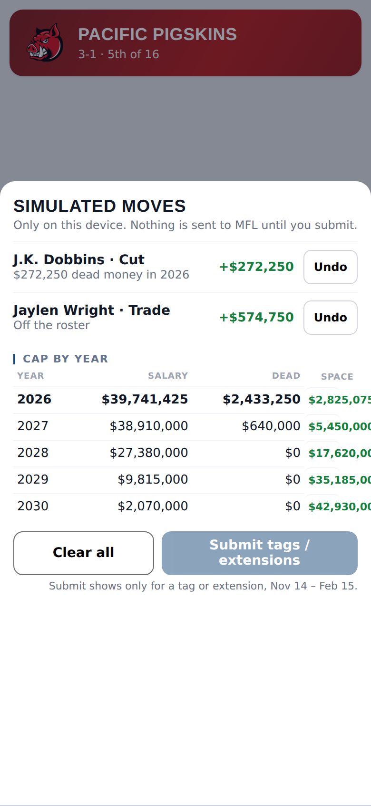

### The cap card (TheLeague, phone only)

It sits under `RosterHeader`, borrowed from Sleeper's team card:

- A 2026 cap-space figure.
- A cap bar split Active / Practice / Dead / simulated. It is built from the
  same numbers as the Cap Subtotals card and is a button that opens Cap by
  year.
- Four chips:
  - **Sims** (count badge): opens the review;
  - **Trade**: the Trade Builder;
  - **Dead $**: scrolls to the dead-money card;
  - **Tags**: franchise-tag options in the League Planner view, or Submit when
    one is pending (open question 9).

Put it in a small `RosterCapStrip` component rather than inside the shared
`RosterHeader`, which the AFL also renders.

### The sim bar

Fixed to the bottom and shown only while `contractActions` is non-empty:

```
[2 sims]  2026 cap space $2,825,075  +$847,000        [Review]
```

- **Delta.** Simulated cap space minus baseline. `updateView` already computes
  the simulated figure. The baseline comes from `calculateCapCharges` (no
  actions) in the same pass, never from a cached DOM value.
- **Chrome.** Mirrors the Set Lineup submit bar: `var(--z-sticky)`,
  `padding-bottom: max(.75rem, env(safe-area-inset-bottom))`. The roster
  section gets matching bottom padding so the bar never covers the last row.
- **Stacking.** It sits under the sheet and the CDM, and hides while either is
  open.
- **Screen readers.** `role=region` + `aria-label`, and a polite live region
  announces the new cap space after each change (cleared after announcing,
  per `accessibility.md`).
- **Scope.** It shows on any viewed team, because simulations apply to
  whichever team is open (open question 6).

### Review / Cap by year sheet

One component with two entry points (sim bar Review, cap bar / Sims chip):

- **Moves:** each simulated move with its cap effect and an **Undo**. The
  row's contract-action badge × is also 16px today; on a phone it gets a
  44px hit area.
- **Cap by year:** Year × Salary / Dead / Space for all five
  `SALARY_YEARS`. These are the tfoot's numbers (`yearTotalN`, `dmTotalN`,
  `capLimitN`, `capSpaceTotalN`), mirrored from the same `updateView` pass that
  writes them, so there is one computation.
- **Clear all** and **Submit tags / extensions.** Today these are
  `#clearAllTagsBtn` and `#submitFranchiseTagsBtn` above the table. A second
  copy must not duplicate the ids. Change `updateClearAllButton` and the submit
  handler to operate on `[data-sim-clear]` / `[data-sim-submit]` (all
  matches), so loading state, `aria-busy`, the error flash and the Nov 14 –
  Feb 15 window gate stay in step across both copies. The originals hide under
  768px. The bind stays in `initRosterPage`: the code comment above
  `handleClearAllTagsClick` records why a module-scope bind broke Submit on
  return visits.

---

## 7. The no-loss inventory

Every element of the desktop roster, and where it lives below 768px.

- "Row" = the three-line card.
- "Salary" / "Summary" / "Game log" = sheet tabs.
- "Hero" = the sheet's quick-action row.
- **TL** = TheLeague, **AFL** = the AFL.

### Columns

| Element | League / mode | Phone home |
|---|---|---|
| Player (name, headshot, position, NFL team) | both | Row line 1 + pill + avatar badge |
| ⋮ Actions column | both | **Hidden**; every action enumerated in section 5 |
| Rank (My Rank) | both | Row, right, small line; Summary metric tile |
| Yrs | TL GM | Row line 2 (chip, still interactive) |
| 2026 (current year) salary | TL GM | Row, right |
| 2027-2030 salary columns | TL GM | Salary › Salary by year |
| Opp # | TL Coach, AFL | Row line 2 (coloured rank); Summary › This week |
| Opponent (vs/@ + logo) | TL Coach, AFL | Row line 2; This week |
| Spread badge (inside Opponent) | TL Coach | Row line 3; This week |
| O/U | TL Coach, AFL | Row line 3 (TL) / This week |
| Weather (temp + icon) | TL Coach, AFL | Row line 2 icon; This week (temp + text) |
| Trend (avg last 3, arrow) | TL Coach | Row line 3; This week |
| W-n weekly trend columns + expand toggle | TL Coach | This week (last-3 scores); Game log (every week) |
| Season Pts | TL Coach | This week; Summary metric tile (existing Points) |
| Avg (season) | TL Coach, AFL | Row, right, small line; This week |
| Opp Avg | TL Coach, AFL | This week |
| Total | AFL | This week; Summary metric tile |
| Proj | TL Coach, AFL | Row, right |

### Cell badges and states

| Element | Phone home |
|---|---|
| Trade-block 🏷️ link (→ Trade Builder) | Row line 1, still a link; Hero toggle state |
| Injury `(Q)` button (→ injury modal) | Row line 1, still a button, 44px hit area |
| Autocut badge (taxi / cut priority) | Row line 1; More actions carries the toggle |
| Contract-action badge (Franchise Tag / Extension / cut / trade) + × remove | Row line 2 with ×; Hero shows "Simulated · Undo"; Review sheet Undo |
| Row states: simulated (amber), cut/traded (50% opacity), mock/demo, eligible avatar ring | Row, same classes |
| Roster-status stripe (active / practice / IR) + position and tier dividers | Card left edge; group headers |
| Years chip eligible / pending / approved-asterisk + deadline countdown | Row line 2; Salary › Extend or tag |
| TO eligible salary cell (tappable) | Salary › year table TO pill (tappable) + Extend or tag |
| TO expired (greyed forfeited salary) | Salary › year table |
| Declared / simulated salary styling | Salary › year table (lifted from the row cells) |
| UFA / future `—` markers | Salary › year table |
| Sortable headers + sort arrows | Sort `<select>` above the rows |
| Header cap space (follows sims) | Unchanged in `RosterHeader`; also on the cap card and the sim bar |

### Page-level

| Element | League | Phone home |
|---|---|---|
| tfoot Dead Money / Total Salary / Salary Cap / Cap Space, current year | TL | Row-list footer, label/value lines |
| tfoot, future years | TL | Cap by year sheet (cap bar / Sims chip / Review) |
| Clear All Tags button | TL | Review sheet (`data-sim-clear`); original hidden on phone |
| Submit Tags/Extensions button (Nov 14 – Feb 15) | TL | Review sheet (`data-sim-submit`); original hidden on phone |
| GM / Coach toggle, My Rank editor | TL / both | Controls row, unchanged |
| Legend (Active / Practice / IR / Trade Block) | TL | Unchanged below the rows; the group headers restate it |
| Cutdown Plan panel (Aug auto-cut) | TL | Unchanged position. **Must be checked at 390px under `?testDate=` inside the June–August window**; the window is closed now, so this capture could not include it |
| Cap Subtotals card | TL | Unchanged (already fits, see `current-theleague-panels.png`); summarised by the cap bar |
| Cap Hits / Dead Money table (720px) | TL | Same card treatment: line 1 player/adjustment, right = current year, line 2 = every other year as `2027 $x · 2028 $y` (the cells get `data-label` if the client builder lacks it). No sheet needed |
| Analytics and League Planner views | TL | **Out of scope, untouched.** Separate `data-view-content` containers; audit separately |
| Year select, "Franchise history" link, roster summary cards, IR section table | AFL | Unchanged; the IR table gets the same card rows |
| Contract demo overlay (`?demo=true`) | TL | Its tips say to tap ⋮; on a phone the copy must say "tap the player". Its mock rows reuse `.yrs-chip` / `.ufa-action-btn` styles |

---

## 8. AFL differences

- **One mode.** The Coach card row applies (Player · Opp · Proj). No GM row,
  no cap card, no sim bar, no simulations.
- **The sheet opens with `hideContract`** (as now) and **no Salary tab**, so no
  tablist (open question 4). It gets `thisWeek`, `quickActions` (Trade block,
  Watch, more) and `moreActions` (IR, Trade, Cut).
- **Actions route to `AFLActionModal`** through
  `window.openAFLActionModal(payload)`, then that modal's action id. It keeps
  confirmation and the write.
- **Two tables** (Active + IR). The same CSS applies to both, and the trigger
  is already on `pageRoot`.
- **Player IDs.** The AFL's rows carry ESPN team codes, while TheLeague's carry
  MFL codes. The NFL-logo badge must go through the dialect-tolerant helpers
  (#1217's `byeWeeksByTeam` lesson).
- **Shared pieces:** `rosters-mobile.css`, the sheet fields, the trigger
  option. The pages stay forked, but these parts are written once.

---

## 9. Implementation plan

Each phase leaves desktop render-identical. **Before and after every phase**,
run `node scripts/roster-parity-check.mjs --all-teams --seasons 2026,2025
--teams <pinned> --out …` at desktop width; pin `--teams`, per the harness
gotcha in `rosters-page-split.md`.

| Phase | What | Files / functions | Verification |
|---|---|---|---|
| 0 | Re-point the branch at `origin/staging`. Baseline both harnesses | — | roster parity + `cdm-parity-check --secret x` (+ `--probe`) saved as `before.json` |
| 1 | **The sheet learns the new fields, with every opener unchanged.** `salary`, `sheetTab`, `thisWeek`, `quickActions`, `moreActions`, `myRank`, `onAction`; tablist + Salary / Game log panels rendered only when `salary` is present; ARIA tabs; bind in the modal's existing page-load re-init path | `src/utils/player-modal-trigger.ts` (`PlayerModalData`), `src/components/theleague/PlayerDetailsModal.astro` | Free Agents and every other opener look identical (screenshots); a Storybook story per state (`docs/claude/rules/storybook.md`); unit tests for pure formatters |
| 2 | **One action list.** Extract `getCdmActionDescriptors` and the renderer from `populateCdmActionOptions`; extract `toggleTradeBlock`; AFL `aflActionsFor(payload)` | `src/utils/cdm-wizard.ts`, `rosters.astro` (`showTradeSubOptions`), `AFLActionModal.astro` | **cdm-parity 0 diffs** (4,409 values + probe); unit-test the descriptor function per contract state |
| 3 | **TheLeague opener builds the payload.** Salary rows lifted from `year1`-`year5` cells; cut / tag / extension / option costs via the page's config-bound wrappers over `salary-calculations`; `thisWeek` lifted from coach cells; `onAction` routes local vs CDM (section 5). Put it in a module, `src/utils/rosters/phone-sheet.ts`, not in the inline script | new module + a small call in `initRosterPage` | Unit tests on the builder; strict typecheck on the module |
| 4 | **Phone rows.** `rosters-mobile.css`; `data-pos` + line spans in the SSR loop **and** `renderTableRows`; hide ⋮; `rowTapMedia`; Sort `<select>`; footer; dead-money card rows; 44px hit areas; position-pill tokens in both themes | both roster pages, new stylesheet, token files | Desktop parity 0 diffs; phone screenshots both leagues, both modes, light + dark; `documentElement.scrollWidth == clientWidth` at 360 / 390 / 767 |
| 5 | **Sim bar + Cap by year + cap card.** Baseline computation in `updateView`; `[data-sim-clear]` / `[data-sim-submit]` hooks; `RosterCapStrip` | `rosters.astro`, new component | Parity; manual: simulate / undo / clear / submit (probe mode for submit) at 390px |
| 6 | **AFL.** Coach rows (already covered by Phase 4 CSS), `thisWeek`, quick / more actions → `AFLActionModal` | `afl-fantasy/rosters.astro`, `AFLActionModal.astro` | AFL screenshots; cross-league gate test |
| 7 | **Lock it in.** Guard `tests/rosters-phone-inventory.test.ts`: parse every `<th data-column>` in both pages (and the SSR row badge slots) and fail when one has no entry in a declared `PHONE_HOMES` map in `src/utils/rosters/phone-inventory.ts`. Wire it into path-guard's `rosters-page` domain. Insights entry; stage a changelog line (ask about `heroWorthy`) | tests, `.claude/hooks/path-guard.json`, `docs/claude/insights/features/`, `weekly-changelog-staging.json` | `pnpm test:unit`, `pnpm test:types` |

---

## 10. Risks

- **ClientRouter lifecycle.**
  - `PlayerDetailsModal`'s script runs once per session, while its DOM is
    swapped per page. The new tab and hero handlers must bind in its existing
    page-load re-init path (it already guards this; see its comments near
    lines 1138 and 1199), never at module scope.
  - `onAction` travels **in the payload**, never as a `window` global. The
    lineup outage was a `window` global surviving a swap.
  - The sim bar lives inside the page's markup, not appended to `<body>`.
  - Any `matchMedia` listener is removed on `astro:before-swap`.
  - `tests/fixtures/clientrouter-init-baseline.json` must not grow.
- **Cross-league init gate.** Both pages are forked siblings, so any new
  `document`-level init must gate on `[data-league="<slug>"]`.
  `tests/cross-league-init-gate.test.ts` already lists both rosters files;
  extend it if a new gated selector is added.
- **Parity harness.** It fingerprints desktop output and must stay at 0 diffs.
  It does not see phone layout, so Phase 4 pairs it with screenshots, as the
  split plan says of Phase 8 (styles).
  - The CDM refactor (Phase 2) is the riskiest step: it touches the module
    that owns real MFL writes. That is why it is its own phase, with
    `cdm-parity-check --probe`.
  - The autocut toggle's save plumbing is Phase 5-territory in the split plan.
    Route to it; do not move it.
- **Typecheck ratchet** (`pnpm test:types`, currently 1384 on `main`'s
  fixture; re-measure on `staging`). New logic goes in typed modules
  (`phone-sheet.ts`, `phone-inventory.ts`), not in `rosters.astro`'s inline
  script. Re-measure after each phase and retighten if the count drops.
  Annotate new object literals: a bare `null` property initialiser infers
  `null`, which cost +20 in Phase 6.1.
- **Forked-page ratchet.** No new sibling route is created. Shared pieces are
  a stylesheet, a component and modules, so `page-fork-baseline.json` does not
  move.
- **Table semantics.** Setting `display: block/grid` on table elements can
  drop table semantics in some screen readers (notably older Safari /
  VoiceOver). A card list is acceptable, but give each card a name: the
  player-name control is the row's accessible entry point, and hidden headers
  mean line-2 values need `aria-label`s or `visually-hidden` prefixes ("2026
  salary", "Projected").
- **Two row builders.** The SSR loop and `renderTableRows` must emit the same
  new attributes. The first client re-render replaces the SSR rows, so a
  mismatch shows as a layout jump on the first simulation. The parity harness
  catches the desktop half; add a phone screenshot after one simulated cut.
- **Colour.** Position-pill and difficulty colours are new tokens. They need
  both theme blocks, and white ink on a fill must clear 4.5:1 (a 14px/700
  label is not large text). Follow `design-system.md` on `html.dark`.
- **Stacked sheets.** Opening the CDM from the sheet must close the sheet
  first and return focus to the row's name control when the CDM closes.

---

## 11. Open questions for the user

**Answered (user, 2026-09-25):**
- **Q1:** GM and Coach stay separate. GM rows get no matchup line.
- **Q6:** Yes. The sim bar shows on every viewed team, not only your own.
- **Pill placement (new):** inline at the start of line 2, under the name, in
  both modes. It is not a leading column.
- **Q2:** Add the kickoff time to the Coach row, before the opponent.
- **Q3:** Reset to the mode's default tab every time the sheet opens (Salary from GM, Summary from Coach).
- **Q4:** The AFL gets Summary / Game log tabs, with no Salary tab.
- **Q5:** After a simulation the sheet stays open and shows "Simulated · Undo".
- **Q7:** The hero on another owner's player shows Trade for him and Watch.
- **Q8:** Sleeper-like pill colours as new tokens, checked in both themes.
- **Q9:** The cap card chips are Sims · Trade · Dead $ · Tags.
- **Q10:** Decide `heroWorthy` when the changelog entry is staged.

Original questions (kept for the record):

1. **GM line 3.** Should GM rows also carry a muted matchup line (both lines
   in one view, as Sleeper does), or stay strictly per mode as proposed?
2. **Kickoff time** on the Coach row is new data: it is not a column today.
   Add it, or start line 2 at the opponent?
3. **Default tab.** GM → Salary, Coach → Summary, reset on every open. Or
   remember the last tab chosen?
4. **AFL tabs.** With no salary it gets no Salary tab. Should it still get
   Summary / Game log tabs, or stay untabbed?
5. **Simulate from the sheet:** keep the sheet open showing "Simulated ·
   Undo" (proposed), or close it the way the CDM does today?
6. **Sim bar on other teams.** Simulations already work on any team being
   viewed. Show the bar there too (proposed), or only on your own team?
7. **Hero actions on another owner's player:** Trade for him + Watch
   (proposed), or also Simulate trade in the hero?
8. **Position-pill colours.** Adopt Sleeper-like hues (QB pink, RB green,
   WR blue, TE orange) as new tokens, or match an existing site scheme?
9. **Cap card chips.** Is Sims · Trade · Dead $ · Tags the right four? Where
   should Tags go: the Planner's franchise-tag options, or Submit?
10. **Changelog.** This is a `new-feature` for both leagues. Is it
    `heroWorthy`?

## Files

- This doc: `docs/plans/rosters-mobile-layout.md`
- Mockup source: `docs/plans/rosters-mobile-layout/mockup.html`
- Current state: `current-theleague-{gm-top,gm-table,gm-table-scrolled,coach-table,action-sheet,player-sheet,panels,deadmoney}.png`, `current-afl-{top,table,action-sheet}.png`
- Proposed: `proposed-{gm-rows,coach-rows,sheet-salary-tab,sheet-summary-tab,sim-review,afl}.png`
